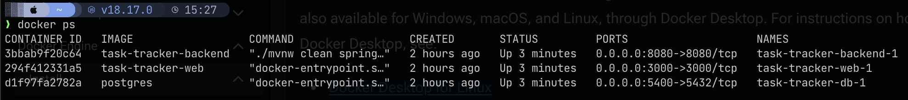

# Task Tracker App
Course: COMP 495 - Capstone

## Overview of App
The Task tracker Application is a tool to help manage your personal or work tasks. The app allows you to create tasks for yourself, create teams and assign tasks to the team. There are also some task tracking features you might see in other tools such as Jira, Trello, etc.. where you can create sprints and assign tasks to them, to better work in a collaborative environment.

## Tech Stack
- Frontend: React
- Backend: Spring Boot
- Database: PostgreSQL

## How to Run the App
1. Install Docker Desktop using this link: https://docs.docker.com/engine/install/
(Be sure to install Docker Desktop not just Docker as you need the docker-compose bundled with Docker Desktop)

2. Clone the project from Github.

3. Open up the project with your preferred IDE (I recommend IntelliJ IDEA free with student email)

4. Open up the terminal and run the following command to build the project: 

```bash
docker-compose up
```

(note: the first time you run this command it may take a few minutes to download the images and build the containers)

5. To verify the containers are running, you can also run the following command:

```bash
docker ps
```
and you should see something like this showing all 3 status as "Up":




### Development

While the containers are running, I have set the project up to hotswap code changes so as soon as you save a file, in the backend or the frontend it will automatically update the container with the new changes. Sometimes it may take a few seconds to reflect.

<!-- # This is my main header

## This is a subheader

This is a paragraph of text.

- This is a bullet point

1. This is a numbered list

## This is another subheader

This is another paragraph of text.

### This is a subsubheader

This is a paragraph of text under a subsubheader.

```Java
public class HelloWorld {
    public static void main(String[] args) {
        System.out.println("Hello, World!");
    }
}
``` -->
